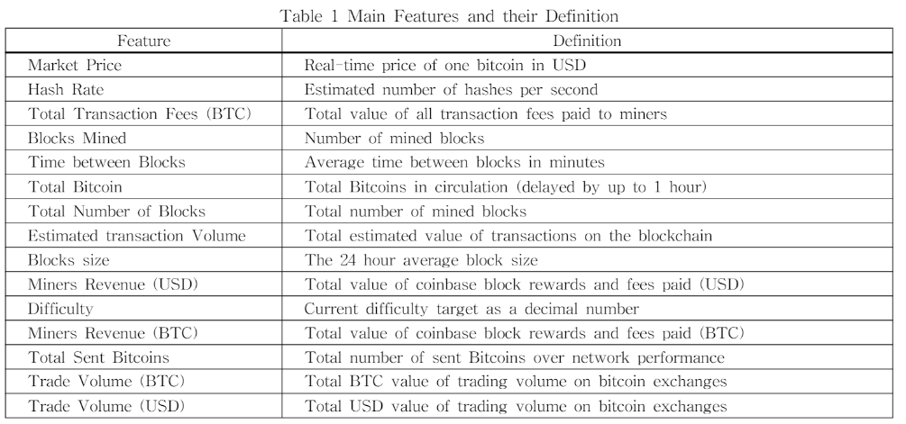
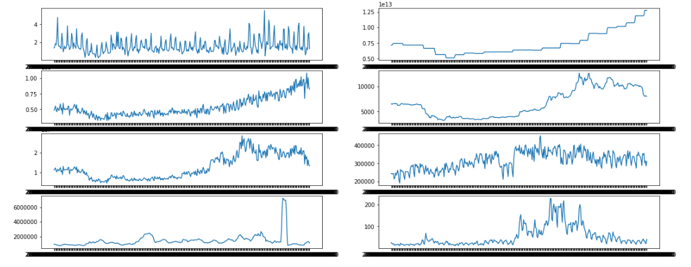
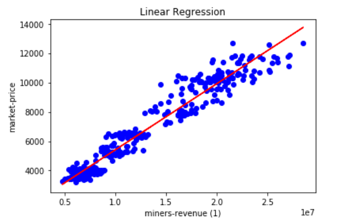
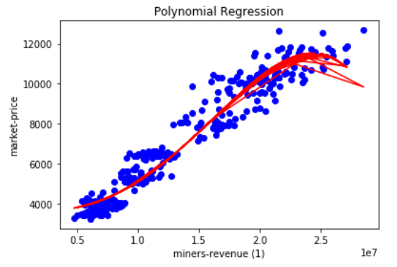

# bitcoin-machinelearning-analysis-paper-implementation

## Contents
* About Project
* Motivation
* Algorithm
* Result
* Tech/framework used

&nbsp;

## About Project

My own implementation of Paper, Analysis on how chracteristics of bitcoin affect price of bitcion using machine learning (머신러닝 기술을 사용한 비트코인 특성들의 비트코인 가격에 미친 영향 분석)

Used **BlockChain API** and implemented on **Polynomial Regression**.

&nbsp;

## Motivation
Quant Project

&nbsp;

## Algorithm
Extracted charateristics of bitcoin from dataset using Blockcahin Wallet API. Implemented polonomial regression to find out whether each charateristic is related to bitcoin price.

Following table shows characteristics used and its definition.

&nbsp;

## Results

Below shows result how each charateristic changes as time passes by.

**Miner's revenue** showed most fitted regression model.

## Tech/framework used
<b>Built with</b>
- python
- Blockchain API

&nbsp;
